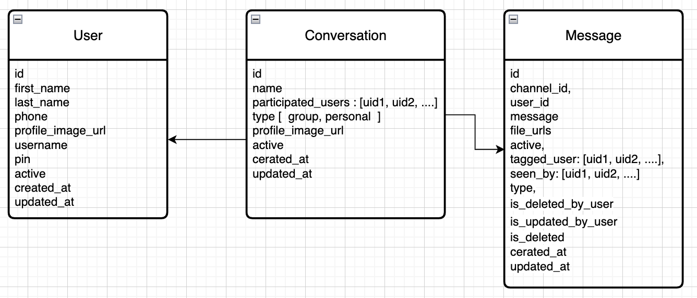

# Chat system design
This project is on MVC archietecture and client-server and event driven pattern

This project uses NoSQL DB (MONGO DB).

-------------
### Project Structure
```
root
|
|--- Controller
|--- Handler
|--- Routes
|--- Utils 
|--- Model 
````
---------
### Project Setup
- Create nodemon.json file on root dir and below
```json
{
    "env": {
        "ENVIROMENT_TYPE": "PRODUCTION",
        "MONGO_URI": "Your Credential Of Mongo db",
        "SERVER_AUTH_TOKEN_SECRET": "Token Secret",
        "PORT": 8300
    }
}
```
---

### Install Required Dependencies
```
npm i
npm install -g nodemon
```
### Run
```
npm start
```

Database Design


